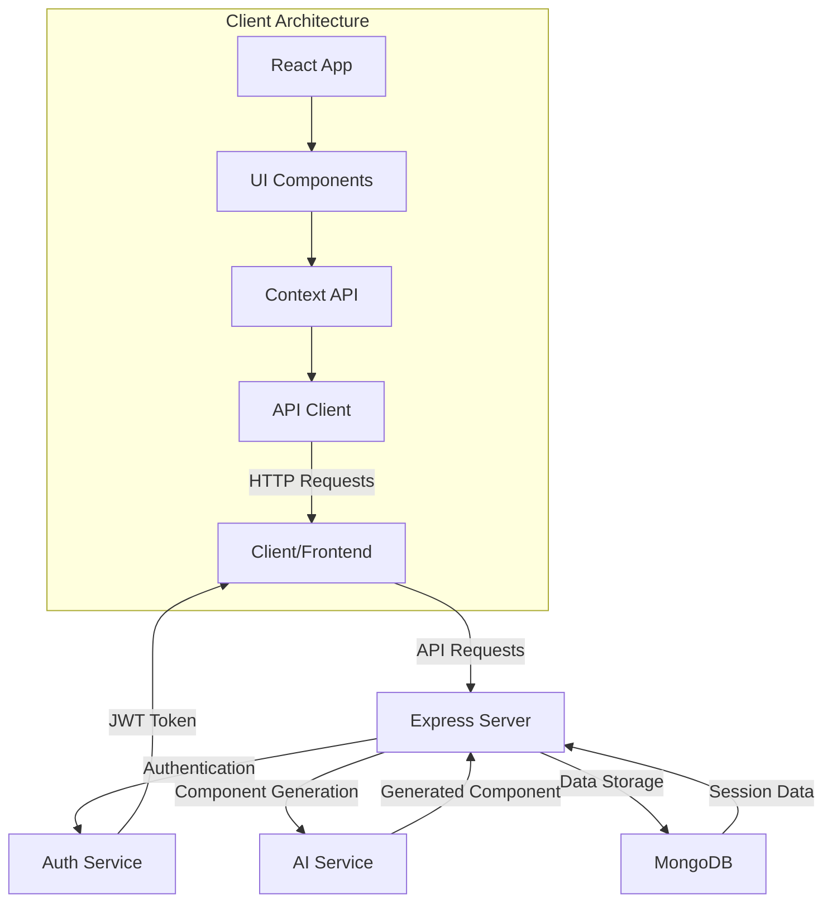
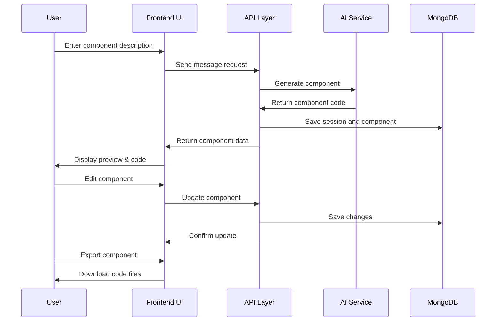

# AI Frontend Playground 

<div align="center">
  
  
  
  
  
</div>

> Generate, edit, and export React components with AI assistance. Design interfaces in minutes instead of hours.

## 📋 Table of Contents

- [Overview](#-overview)
- [Features](#-features)
- [System Architecture](#-system-architecture)
- [Tech Stack](#-tech-stack)
- [Getting Started](#-getting-started)
- [Project Structure](#-project-structure)
- [Screenshots](#-screenshots)
- [API Documentation](#-api-documentation)
- [Deployment](#-deployment)
- [Contributing](#-contributing)
- [License](#-license)

## 🚀 Overview

AI Frontend Playground is an innovative platform that uses AI to generate React components based on user descriptions. It enables developers, designers, and product teams to rapidly prototype UI components, visualize designs, and export production-ready code.

The application uses a chat-based interface where users describe what they want to build, and the AI generates the corresponding React component with TypeScript types, Tailwind CSS styling, and proper structure. Users can preview, edit, and export the generated components.

## ✨ Features

- **AI-Powered Generation**: Describe UI components in plain English and get working React code
- **Live Preview**: Instantly see your components rendered with real-time updates
- **Code Editor**: View and edit the generated TypeScript/JSX code with syntax highlighting
- **Export Options**: Download components as TSX files, CSS files, or complete ZIP packages
- **Session Management**: Save, organize and reuse your component generation history
- **Component Sharing**: Share component previews with anyone via unique URLs
- **Dark/Light Mode**: Toggle between light and dark themes for comfortable viewing

## 🏗️ System Architecture



### Data Flow Diagram



## 🛠️ Tech Stack

### Frontend
- **React 18**: UI framework with functional components and hooks
- **TypeScript**: Type-safe code development
- **React Router 6**: For SPA routing
- **TailwindCSS**: Utility-first CSS framework
- **Radix UI**: Accessible component primitives
- **Vite**: Fast development server and building tool
- **React Query**: Data fetching and caching
- **Babel**: For JSX transformation in the component previewer

### Backend
- **Node.js**: JavaScript runtime
- **Express**: Web server framework
- **MongoDB**: NoSQL database for storing sessions and components
- **Mongoose**: MongoDB object modeling
- **JWT**: Authentication via JSON Web Tokens
- **OpenAI API**: AI model integration for component generation

### DevOps & Tools
- **Docker**: Containerization for consistent environments
- **GitHub Actions**: CI/CD pipeline
- **ESLint/Prettier**: Code quality and formatting

## 🏁 Getting Started

### Prerequisites
- Node.js 16+ and npm
- MongoDB instance (local or Atlas)
- OpenAI API key

### Installation

1. Clone the repository:
   ```bash
   git clone https://github.com/PriyanshK09/ai-frontend-playground.git
   cd ai-frontend-playground
   ```

2. Install dependencies:
   ```bash
   npm install
   ```

3. Configure environment variables:
   Create a `.env` file based on `.env.example`:
   ```env
   MONGODB_URI=your_mongodb_connection_string
   JWT_SECRET=your_jwt_secret
   OPENAI_API_KEY=your_openai_api_key
   OPENAI_BASE_URL=https://api.openai.com/v1
   AI_MODEL=gpt-4
   CLIENT_URL=http://localhost:5173
   ```

4. Start development server:
   ```bash
   npm run dev
   ```

5. Visit `http://localhost:5173` in your browser

### Docker Setup

```bash
# Build the Docker image
docker build -t ai-frontend-playground .

# Run the container
docker run -p 3001:3001 -p 5173:5173 --env-file .env ai-frontend-playground
```

## 📂 Project Structure

```
frontend/
├── client/                  # Frontend React application
│   ├── components/          # React components
│   │   ├── ui/              # Reusable UI components
│   │   └── workspace/       # Workspace-specific components
│   ├── lib/                 # Utility functions & services
│   ├── pages/               # Page components
│   ├── App.tsx              # Main app component & routing
│   └── global.css           # Global styles
├── server/                  # Backend Express server
│   ├── config/              # Configuration files
│   ├── middleware/          # Express middleware
│   ├── models/              # MongoDB models
│   ├── routes/              # API routes
│   ├── services/            # Business logic services
│   └── index.ts             # Server entry point
├── shared/                  # Shared TypeScript types
├── public/                  # Static assets
└── .env                     # Environment variables
```

### Key Files

| File | Description |
|------|-------------|
| `client/App.tsx` | Main React component with routing |
| `client/components/workspace/Sidebar.tsx` | Session management sidebar |
| `client/components/workspace/ChatPanel.tsx` | AI chat interface |
| `client/components/workspace/ComponentPreview.tsx` | Live component previewer |
| `client/lib/api.ts` | API client for server communication |
| `server/index.ts` | Express server setup |
| `server/services/aiService.ts` | AI integration service |
| `server/models/Session.ts` | MongoDB data model for sessions |

## 📷 Screenshots

<div align="center">
  
  <p><em>The main workspace with AI chat and component preview</em></p>

  
  <p><em>Editing and customizing a generated component</em></p>
</div>

## 📘 API Documentation

### Authentication

| Endpoint | Method | Description |
|----------|--------|-------------|
| `/api/auth/signup` | POST | Register a new user |
| `/api/auth/login` | POST | Login and get JWT token |
| `/api/auth/verify` | GET | Verify JWT token |

### Sessions

| Endpoint | Method | Description |
|----------|--------|-------------|
| `/api/sessions` | GET | Get all sessions for user |
| `/api/sessions` | POST | Create a new session |
| `/api/sessions/:id` | GET | Get a specific session |
| `/api/sessions/:id` | PUT | Update session details |
| `/api/sessions/:id` | DELETE | Delete a session |
| `/api/sessions/:id/messages` | POST | Send a message in session |
| `/api/sessions/:id/component` | PUT | Update a component |

### Component Sharing

| Endpoint | Method | Description |
|----------|--------|-------------|
| `/api/share/:componentId` | GET | Get a publicly shared component |

## 🌐 Deployment

### Vercel Deployment
```bash
npm run build
vercel --prod
```

### Docker Production Deployment
```bash
docker build -t ai-frontend-playground:prod -f Dockerfile.prod .
docker run -p 80:3001 -p 443:3001 --env-file .env.prod ai-frontend-playground:prod
```

## 🤝 Contributing

We welcome contributions to AI Frontend Playground! Please check out our [Contributing Guidelines](CONTRIBUTING.md) to get started.

1. Fork the repository
2. Create a feature branch: `git checkout -b feature-name`
3. Commit changes: `git commit -m 'Add some feature'`
4. Push to the branch: `git push origin feature-name`
5. Submit a pull request

## 📄 License

This project is licensed under the MIT License - see the [LICENSE](LICENSE) file for details.

## 🙏 Acknowledgements

- OpenAI for providing the AI capabilities
- The React and TypeScript communities for excellent documentation
- All contributors who have helped shape this project

---

<div align="center">
  <p>Made with ❤️ by PriyanshK09</p>
  <p>
    <a href="https://github.com/PriyanshK09/AssignmentAccioJob">GitHub</a> •
    <a href="https://ai-frontend-playground.com">Website</a> •
    <a href="mailto:contact@ai-frontend-playground.com">Contact</a>
  </p>
</div>
